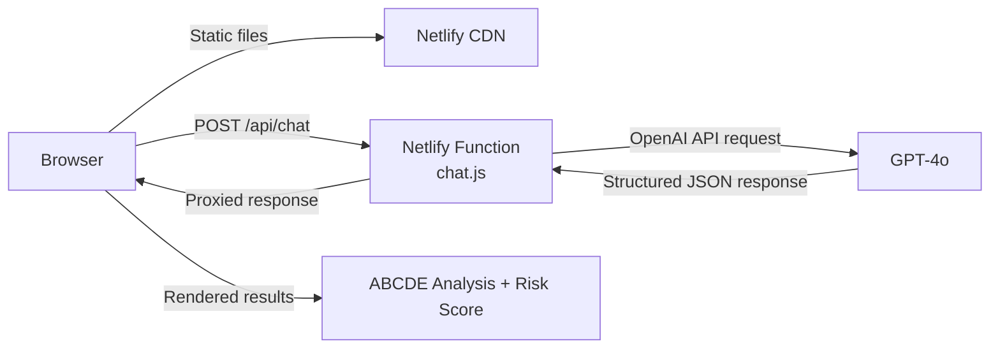

# SkinScan Pro — AI Skin Lesion Analyzer

[](https://skinscan.autoflowca.com/)
[](https://platform.openai.com/docs/models/gpt-4o)
[](https://netlify.com)
[](LICENSE)

> An AI-powered web application that analyzes skin lesions using the clinical ABCDE dermatological screening method. Powered by OpenAI GPT-4o vision via a secure Netlify serverless backend.

---

## Live Demo

**[https://skinscan.autoflowca.com/](https://skinscan.autoflowca.com/)**

Upload a photo of a mole or skin spot, select any clinical changes you've noticed, and receive a structured risk assessment in seconds.

---

## Features

- **Multimodal AI analysis** — Upload a skin lesion image processed by GPT-4o vision with `detail: "high"` for fine-grained evaluation
- **ABCDE criteria assessment** — Structured analysis across Asymmetry, Border, Color, Diameter, and Evolution
- **Risk quantification** — Malignancy probability estimate (10%–90%) with Low / Medium / High classification
- **Clinical history input** — Supplement image analysis with reported symptom changes (size, shape, color, itchiness)
- **Text-only mode** — Run an assessment based on clinical history alone, without an image
- **Secure API proxy** — OpenAI key stays server-side via Netlify Functions, never exposed to the browser

---

## How It Works



1. The user uploads an image and/or selects clinical symptom changes
2. The frontend builds an OpenAI chat completions payload and sends it to `/api/chat`
3. A Netlify serverless function proxies the request to OpenAI using a server-side API key
4. GPT-4o returns a structured JSON response with ABCDE criteria, risk percentage, and recommendation
5. The frontend renders the parsed results in a medical-themed UI

---

## Prompt Engineering

The AI integration uses a carefully structured prompting strategy:

**System prompt** frames GPT-4o as a dermatology-specialized medical assistant instructed to apply the ABCDE clinical criteria and maintain a professional medical tone.

**Structured JSON output** is enforced by appending an explicit schema instruction to both the system and user messages. This dual-injection pattern significantly increases compliance with the expected output format:

```json
{
  "criteria": { "Asymmetry": "...", "Border": "...", "Color": "...", "Diameter": "...", "Evolution": "..." },
  "risk": { "percentage": 35, "level": "Medium", "findings": "..." },
  "recommendation": "..."
}
```

**Risk range (10%–90%, 5% increments)** avoids false certainty at the extremes and communicates that results are probabilistic estimates, not diagnoses.

**Response parsing pipeline**: JSON.parse (primary) → regex-based markdown fallback for cases where the model returns fenced code blocks despite instructions.

---

## Tech Stack

| Layer | Technology |
|-------|------------|
| Frontend | HTML5, CSS3, Vanilla JavaScript |
| AI Model | OpenAI GPT-4o (vision + text) |
| Backend | Netlify Functions (Node.js serverless) |
| Hosting | Netlify |
| Icons | Font Awesome 6 |

---

## Getting Started

### Prerequisites

- [Node.js](https://nodejs.org/) 18+
- [Netlify CLI](https://docs.netlify.com/cli/get-started/) — `npm install -g netlify-cli`
- An [OpenAI API key](https://platform.openai.com/api-keys) with GPT-4o access

### Setup

```bash
git clone https://github.com/<your-username>/MoleChecker.git
cd MoleChecker
npm install
cp .env.example .env
# Edit .env and paste your OPENAI_API_KEY
netlify dev
```

Open [http://localhost:8888](http://localhost:8888) in your browser.

---

## Project Structure

```
MoleChecker/
├── netlify/
│   └── functions/
│       └── chat.js         # Serverless proxy to OpenAI API (API key stays server-side)
├── public/
│   ├── index.html          # Single-page application entry point
│   ├── script.js           # Frontend logic + AI prompt engineering
│   └── styles.css          # Responsive medical UI (CSS custom properties)
├── .env.example            # Environment variable template
├── netlify.toml            # Netlify build + redirect configuration
└── package.json
```

---

## Disclaimer

This tool is for informational and screening purposes only. It does not constitute medical advice, diagnosis, or treatment. Always consult a qualified healthcare professional for proper medical evaluation.

---

## License

[MIT](LICENSE)
